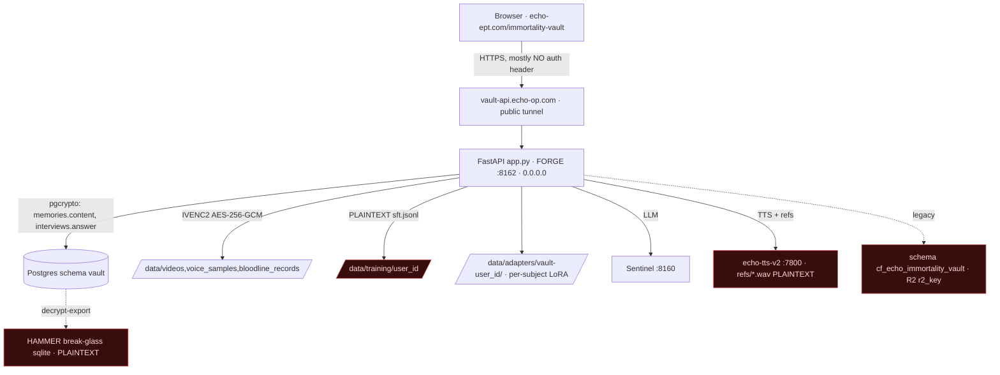

# Immortality Vault V3 — P0: Truth, Threat & Data-Flow Audit

> Build #24413 · Phase P0 · seat `cc-builder-auto253-hammer` · 2026-07-25
> Read-only audit of the live system. Every finding cites the evidence that produced it.
> **This is the evidence baseline. Fixes are tracked in [`REMEDIATION_MATRIX.md`](./REMEDIATION_MATRIX.md).**

---

## 1. System inventory (canonical surfaces)

| Layer | What | Location | Notes |
|---|---|---|---|
| Frontend | Next.js static export, route `/immortality-vault/*` | repo `ECHO-OMEGA-PRIME/echo-prime-tech`, `app/immortality-vault/` | Deployed to Vercel → `echo-ept.com/immortality-vault`. Target brand domain `immortalityvault.app`. |
| API base | `https://vault-api.echo-op.com` | `app/immortality-vault/app/lib/constants.ts:7` | **Public** Cloudflare tunnel → FORGE `:8162`. Browser calls it directly. |
| Backend | FastAPI monolith `app.py` (185 KB) | FORGE `/home/forge/echo-immortality-vault/app.py` | `echo-immortality-vault.service`, `uvicorn app:app --host 0.0.0.0 --port 8162 --workers 2`. |
| Backend modules | `bloodline_api.py`, `bloodline_p2..p5.py`, `consent_gate.py`, `db_crypto.py`, `vault_crypto.py`, `questions.py`, `train_person_adapter.py`, `training_readiness_watcher.py`, `nudge_tick.py` | same dir | Schema: `schema.sql`, `bloodline_schema.sql`, `bloodline_p5_schema.sql`, `migrations/`. |
| Database | Postgres `echo`, schema **`vault`** (26 tables) | FORGE `127.0.0.1:5432` | Legacy CF-D1 mirror in schema `cf_echo_immortality_vault` (pre-migration copy — **separate exposure, purge candidate**). |
| Media at rest | `data/{videos,voice_samples,bloodline_records,training,adapters}` | FORGE `/home/forge/echo-immortality-vault/data` | Videos/voice/photos = IVENC2 AES-256-GCM. Training JSONL + adapters = **plaintext** (see §4). |
| Voiceprints | `*.wav` reference clips | FORGE `/home/forge/echo-tts-v2/refs/` | **Plaintext** biometric voice refs (separate service). |
| Personas/models | per-subject QLoRA adapters `data/adapters/vault-<user_id>/` on base `Qwen/Qwen2.5-14B-Instruct` | FORGE | Registry `arcanum_sdk.personality_registry`; voice `arcanum_sdk.person_voice_samples`. |
| LLM / TTS deps | Sentinel `:8160`, TTS `:7800` | FORGE loopback | |
| Backups | `echo-restic-vault.timer` (daily restic of master_vault.db), `echo-vault-snapshot.timer` (**decrypt-export to HAMMER break-glass sqlite**) | FORGE timers | Decrypted copy on HAMMER is **outside this service's crypto boundary**. |

## 2. Data-flow diagram

Auth primitives exist — `_verify_firebase_request()` (`app.py:115`) and `_require_same_user()` (`app.py:142`) — but are wired to **only 10 call sites** (voice-profile, consent, video endpoints). Everything else trusts a caller-supplied `user_id`/`viewer`.

## 3. Threat model — ranked findings (live evidence)

| # | Severity | Finding | Evidence | Phase |
|---|---|---|---|---|
| F1 | **P0 · critical · internet-facing** | Systemic BOLA/IDOR: ~70 of ~80 endpoints unauthenticated. `/memories/{user_id}`, `/interview/**`, `/personality/**`, `/eternal/**`, `/training/build-dataset/{user_id}`, entire `/bloodline/**` surface, `/consciousness/**`, `/guide/ask`, `/voice/synthesize`, `/voice/transcribe` require no token — access is granted by supplying an id. Bloodline living-relative redaction keys off a `viewer` **query param the caller supplies** (`app.py ~2276`), not identity. | grep of `_require_same_user`/`_verify_firebase_request` call sites = 10 (lines 1117,1185,1284,1326,1346,1356,1389,1398,1435,1454); client attaches token only in `consentHeaders` (`vault-api.ts:344`). API base is public (`constants.ts:7`). | **P1** |
| F2 | **P0 · high** | Plaintext training corpus at rest reverses DB encryption. `data/training/<user_id>/sft.jsonl` (8 files) hold the **decrypted** persona prompt + personal memories in cleartext. | subagent read of `sft.jsonl` first record. | **P2/P4** |
| F3 | P1 · high | Plaintext voiceprints `echo-tts-v2/refs/*.wav` (e.g. `commander_ref.wav`); `vault_crypto.py` header itself defers these to "phase 2". Biometric voice = uniquely sensitive. | `file` magic = `RIFF/WAV`. | **P2** |
| F4 | P1 · high | `VAULT_STRICT` unset → `decrypt_bytes()` silently passes plaintext media through instead of rejecting it (downgrade path open). | unit env has no `VAULT_STRICT`; `vault_crypto.py` passthrough branch. | **P2** |
| F5 | P1 · med | Plaintext sensitive DB columns: `vault.family_records.ocr_text` (21 rows), `vault.personality_traits.evidence` (2 rows). `eternal_messages.message_text`, `chat_messages.content`, `biometric_captures.data_json` have **no** encryption wiring → future writes land plaintext. Encryption is a code convention (`PGP:` prefix), not a schema constraint. | `count(PGP:%)` vs total per column. | **P2** |
| F6 | P2 · med | Decrypted break-glass export to HAMMER (`echo-vault-snapshot.timer`); legacy `cf_echo_immortality_vault` schema + R2 `r2_key` objects — copies outside the crypto boundary. | `systemctl list-timers`, schema list. | **P2/P6** |
| F7 | P2 · med | Consent split-brain: `vault.biometric_consent` (enforced) vs `arcanum_sdk.persons_consent_log` (separate, unwired). No consent gate on **text/bloodline** ingestion — third-party biographical data writable via unauth `/memories`, `/bloodline/**`, `/interview`. | `consent_gate.py` vs registry table; §2 endpoint auth. | **P1/P4** |

**Positive controls to credit:** IVENC2 AES-256-GCM with path-bound AAD + atomic writes for videos/voice_samples/photos; pgcrypto on `memories.content` & `interviews.answer`; fail-closed biometric consent gate with first-class revocation + right-to-delete and a **human-only** `authority_verified` path for deceased/incapacitated subjects (models never auto-approve); per-subject QLoRA adapter isolation.

## 4. Public-claim audit (deployed copy vs proven behavior)

| Claim (live copy) | Source | Reality | Verdict |
|---|---|---|---|
| "Every recording and memory is **encrypted** and **family-controlled** … never sold, **never used to train anything**, never shared." | `page.tsx:51`, FAQ `page.tsx:72`, `EchoChatWidget.tsx:27` | Media & 2 text columns encrypted, BUT (a) **not family-controlled** — IDOR exposes them to anyone (F1); (b) training corpus is **plaintext** (F2) and (c) subject data **IS** used to train that subject's own adapter (`/training/build-dataset`, `data/adapters/vault-*`). | **FALSE as written** — fix behavior (F1/F2) **and** correct copy: subject data may train only that subject's own authorized model, with explicit consent. |
| "keep the image encrypted" (bloodline docs) | `BloodlinePanel.tsx:303` | Photos IVENC2-encrypted ✅, but `family_records.ocr_text` extracted from them is **plaintext** (F5) and the record image URL is unauthenticated (F1). | **PARTIALLY TRUE** — fix F1/F5. |
| "Living relatives stay private — direct line only, never traced without consent." | `page.tsx:249` | Redaction depends on a **caller-supplied `viewer`** param (F1) → trivially bypassed. | **FALSE** — fix F1. |

## 5. P0 exit

P0 acceptance = checked-in data-flow diagram + threat model + claim audit + remediation matrix with live evidence — **met by this file + `REMEDIATION_MATRIX.md`**. No code behavior changed in P0 (audit only). Highest-value next work = **P1** (close F1, the internet-facing IDOR) then **P2** (F2–F6 crypto coverage). Public copy stays as-is until behavior is proven, then is corrected in P10; until then the claims are tracked as known-untrue in the matrix.
